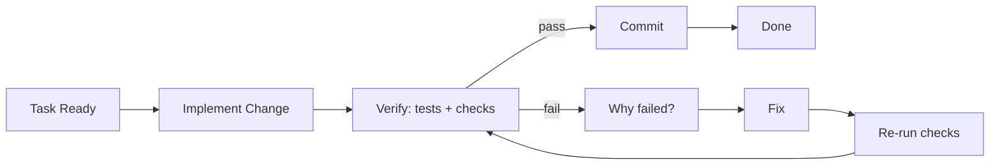
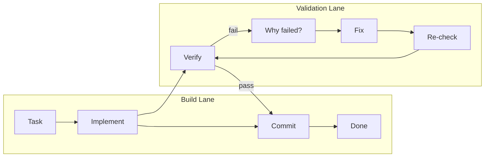
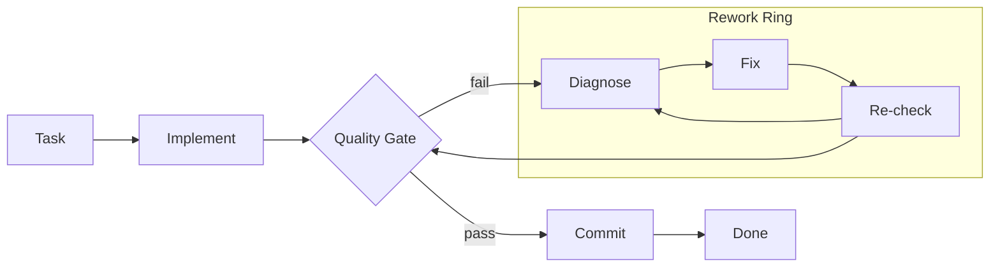
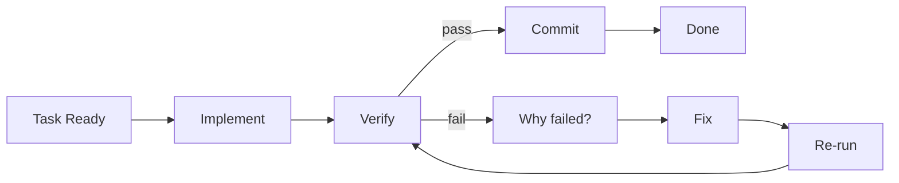
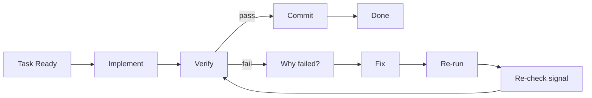

# Work Command Diagram Options

Goal: pick the most intuitive flow for `/flux:work` before we implement visuals.

## Option A - State Machine (Most explicit)



Why this works:
- Clearly shows pass path vs fail path.
- Matches real engineering loop semantics.
- Easy to animate with pulse lanes.

---

## Option B - Dual-Lane (Action vs Validation)



Why this works:
- Separates coding from quality control.
- Clean mental model for teams.
- Good for a diagram that feels "systematic".

---

## Option C - Gate + Rework Ring (Most visual)



Why this works:
- Very distinctive shape.
- Makes "gate" concept obvious.
- Great for cinematic animations.

---

## Animation Notes (for whichever option wins)

- Nodes stay static; only traces pulse.
- Slow cadence: 8-10s per full loop.
- Fail path pulses in a different intensity than pass path.
- Commit path should feel like a clear "release" moment.

---

## Locked Draft v1 (Chosen)

Chosen so far:
- Base: Option A (State Machine)
- Priority: Intuitive correctness
- Labels: Engineer precise



UX intent:
- Main lane (happy path): `Task Ready -> Implement -> Verify -> Commit -> Done`
- Failure lane (below): `Verify -> Why failed? -> Fix -> Re-run -> Verify`
- This keeps "what happens" and "why it loops" obvious without visual noise.

---

## Locked Constraints v2

Chosen interaction constraints:
- Fail branch: **vertical drop** from `Verify`
- Retry lane depth: **shallow** (close to main lane)
- Branch labels: **explicit `pass` / `fail`**

### Variant A - Direct Return to Verify (Recommended)


Notes:
- Most literal and easiest to reason about.
- Re-check flows directly into verify, matching runtime behavior.

### Variant B - Re-run Gate Before Verify



Notes:
- Adds one tiny semantic checkpoint before re-entering `Verify`.
- Slightly richer but still clean.

### Layout guidance for final UI implementation

- Main lane y-axis: centerline.
- Retry lane y-axis: ~40-56px below centerline (shallow, not deep).
- `Verify -> Why failed?` edge should be vertical first, then horizontal.
- Keep nodes static; animate pulses only.

---

## Iteration 2 - Fail Loop Layout Fixes

**Problem identified:** The current fail loop has nodes in illogical order (Re-run LEFT of Fix) causing crossing lines.

### Variation 2A - Linear fail loop (flows right, returns left)

```
Main:    Task → Implement → Verify ----→ Commit → Done
                              ↓    pass
                              fail
                              ↓
Fail:                    Why failed? → Fix → Re-run
                              ↑__________________|
```

Node positions:
- Why failed?: x=320, y=165 (directly below Verify)
- Fix: x=420, y=165 (to the right)
- Re-run: x=520, y=165 (further right)
- Re-run connects back to Verify with an orthogonal path going up

**Pros:** Clear left-to-right reading, no crossing lines
**Cons:** Re-run is far right, return path is long

---

### Variation 2B - Compact clockwise loop (below Verify)

```
Main:    Task → Implement → Verify ----→ Commit → Done
                              ↓    pass
                              fail
                         Why failed?
                              ↓
                    Re-run ← Fix
                      ↑______|
```

Node positions:
- Why failed?: x=320, y=155 (below Verify)
- Fix: x=380, y=195 (down-right)
- Re-run: x=260, y=195 (down-left)
- Re-run connects back up to Verify

**Pros:** Compact, clear clockwise flow, loop is self-contained
**Cons:** Slightly deeper vertical drop

---

### Variation 2C - Inline retry lane (same depth, logical order)

```
Main:    Task → Implement → Verify ----→ Commit → Done
                              ↓    pass
Fail:            Re-run ← Fix ← Why?
                   |_____________↑ (returns to Verify)
```

Node positions:
- Why failed?: x=320, y=160
- Fix: x=250, y=160 (LEFT of Why - reverse visual order)
- Re-run: x=180, y=160 (further left)
- Re-run connects to Verify going right

**Pros:** Very shallow, all on one line
**Cons:** Reads right-to-left which is counterintuitive

---

### Variation 2D - Stacked vertical loop

```
Main:    Task → Implement → Verify ----→ Commit → Done
                              |    pass
                              fail
                              ↓
                         Why failed?
                              ↓
                             Fix
                              ↓
                           Re-run
                              ↓
                         (back to Verify)
```

**Pros:** Very clear sequential flow
**Cons:** Takes more vertical space, may look unbalanced

---

## Recommended: Variation 2B (Compact clockwise loop)

Rationale:
- Keeps the loop visually contained below Verify
- Clear clockwise reading pattern
- No line crossings
- Moderate depth (not too deep, not too shallow)
