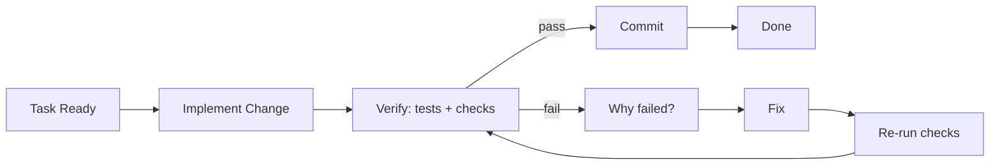
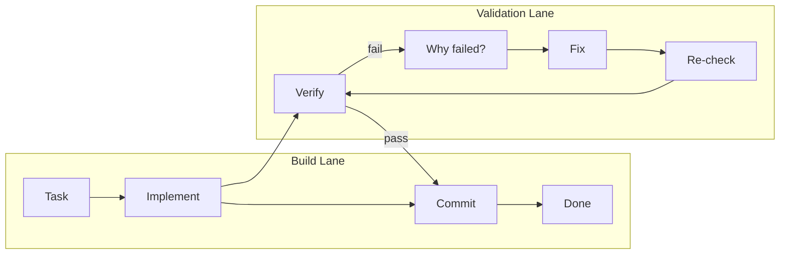
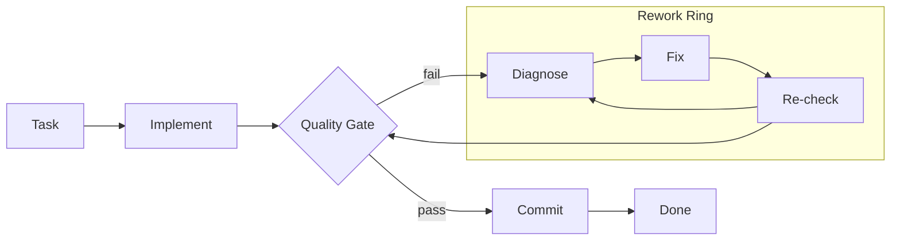
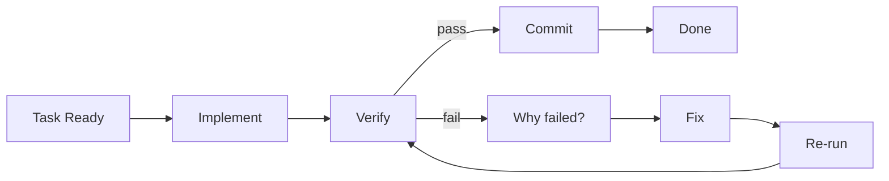
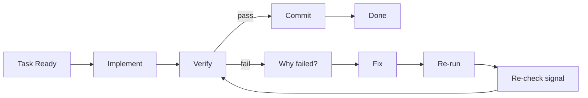

# Work Command Diagram Options

Goal: pick the most intuitive flow for `/flux:work` before we implement visuals.

## Option A - State Machine (Most explicit)

Why this works:
- Clearly shows pass path vs fail path.
- Matches real engineering loop semantics.
- Easy to animate with pulse lanes.

---

## Option B - Dual-Lane (Action vs Validation)

Why this works:
- Separates coding from quality control.
- Clean mental model for teams.
- Good for a diagram that feels "systematic".

---

## Option C - Gate + Rework Ring (Most visual)

Why this works:
- Very distinctive shape.
- Makes "gate" concept obvious.
- Great for cinematic animations.

---

## Animation Notes (for whichever option wins)

- Nodes stay static; only traces pulse.
- Slow cadence: 8-10s per full loop.
- Fail path pulses in a different intensity than pass path.
- Commit path should feel like a clear "release" moment.

---

## Locked Draft v1 (Chosen)

Chosen so far:
- Base: Option A (State Machine)
- Priority: Intuitive correctness
- Labels: Engineer precise

UX intent:
- Main lane (happy path): `Task Ready -> Implement -> Verify -> Commit -> Done`
- Failure lane (below): `Verify -> Why failed? -> Fix -> Re-run -> Verify`
- This keeps "what happens" and "why it loops" obvious without visual noise.

---

## Locked Constraints v2

Chosen interaction constraints:
- Fail branch: **vertical drop** from `Verify`
- Retry lane depth: **shallow** (close to main lane)
- Branch labels: **explicit `pass` / `fail`**

### Variant A - Direct Return to Verify (Recommended)

Notes:
- Most literal and easiest to reason about.
- Re-check flows directly into verify, matching runtime behavior.

### Variant B - Re-run Gate Before Verify

Notes:
- Adds one tiny semantic checkpoint before re-entering `Verify`.
- Slightly richer but still clean.

### Layout guidance for final UI implementation

- Main lane y-axis: centerline.
- Retry lane y-axis: ~40-56px below centerline (shallow, not deep).
- `Verify -> Why failed?` edge should be vertical first, then horizontal.
- Keep nodes static; animate pulses only.
